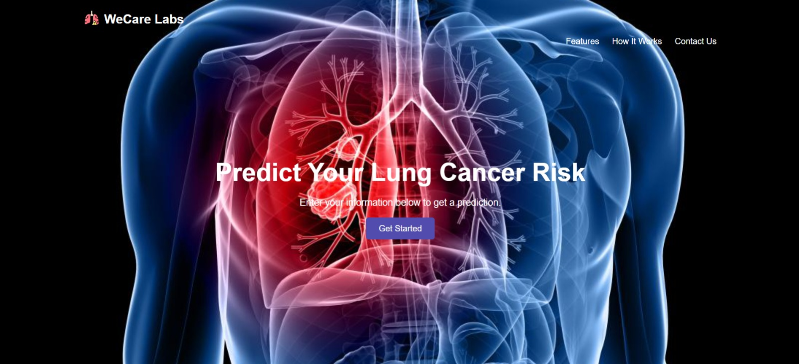

# Lung Cancer Prediction Project



## Table of Contents

1. [Project Overview](#project-overview)
2. [Dataset](#dataset)
    - [About the Dataset](#about-the-dataset)
    - [Dataset Source](#dataset-source)
    - [Columns](#columns)
3. [Pipeline Components](#pipeline-components)
    - [Data Preprocessing](#1-data-preprocessing)
    - [Feature Engineering](#2-feature-engineering)
    - [Model Training](#3-model-training)
    - [Model Evaluation](#4-model-evaluation)
    - [Model Deployment](#5-model-deployment)
4. [Setup and Installation](#setup-and-installation)
5. [Usage](#usage)
6. [Deploying as Docker](#deploying-as-docker)
7. [Contribution Guidelines](#contribution-guidelines)
8. [License](#license)

## Project Overview

This project is a web application with the aim to predict the likelihood of a patient developing lung cancer based on various risk factors. The application features an end-to-end automated machine learning pipeline that includes data preprocessing, model training, evaluation, and deployment. This hands-on project emphasizes MLOps practices to automate ML workflows effectively.

## Dataset

### About the Dataset

This dataset contains information on patients with lung cancer, including their age, gender, air pollution exposure, alcohol use, dust allergy, occupational hazards, genetic risk, chronic lung disease, balanced diet, obesity, smoking status, passive smoker status, chest pain, coughing of blood, fatigue levels, weight loss, shortness of breath, wheezing, swallowing difficulty, clubbing of finger nails, frequent colds, dry coughs, and snoring.

### Dataset Source

The dataset is sourced from [Kaggle - Lung Cancer Prediction](https://www.kaggle.com/datasets/thedevastator/cancer-patients-and-air-pollution-a-new-link/data).

### Columns
```
| Column Name                  | Description                                               |
|------------------------------|-----------------------------------------------------------|
| Age                          | The age of the patient.                                   |
| Gender                       | The gender of the patient.                                |
| Air Pollution                | The level of air pollution exposure of the patient.       |
| Alcohol Use                  | The level of alcohol use of the patient.                  |
| Dust Allergy                 | The level of dust allergy of the patient.                 |
| Occupational Hazards         | The level of occupational hazards of the patient.         |
| Genetic Risk                 | The level of genetic risk of the patient.                 |
| Chronic Lung Disease         | The level of chronic lung disease of the patient.         |
| Balanced Diet                | The level of balanced diet of the patient.                |
| Obesity                      | The level of obesity of the patient.                      |
| Smoking                      | The level of smoking of the patient.                      |
| Passive Smoker               | The level of passive smoker of the patient.               |
| Chest Pain                   | The level of chest pain of the patient.                   |
| Coughing of Blood            | The level of coughing of blood of the patient.            |
| Fatigue                      | The level of fatigue of the patient.                      |
| Weight Loss                  | The level of weight loss of the patient.                  |
| Shortness of Breath          | The level of shortness of breath of the patient.          |
| Wheezing                     | The level of wheezing of the patient.                     |
| Swallowing Difficulty        | The level of swallowing difficulty of the patient.        |
| Clubbing of Finger Nails     | The level of clubbing of finger nails of the patient.     |
```

## Pipeline Components

### 1. Data Preprocessing
- Importing Libraries: Import necessary libraries such as pandas, numpy, matplotlib, and seaborn.
- Loading Dataset: Load the dataset into a pandas DataFrame.
- Dataset Info: Display information about the dataset, including data types and missing values.
- Dataset Description: Provide a statistical summary of the dataset.
- Handling Missing Values: Check for and handle any missing values.
- Handling Duplicates: Check for and remove duplicate entries.

### 2. Feature Engineering 
- Encoding Categorical Variables: Convert the categorical target variable 'Level' ('Low', 'Medium', 'High') to numeric values (0, 1, 2) using label encoding.

- Feature Removal: Drop the 'Patient Id' column as it does not contribute to the prediction of the target variable.

- Data Splitting: Separate the dataset into features (X) and target variable (y).

- Split the data into training and testing sets, with a specified test size of 30%.


### 3. Model Training
- Trained a K-Nearest Neighbors classifier (KNeighborsClassifier) with k=3 and 'distance' weights.

### 4. Model Evaluation
- Used the trained KNN model to make predictions on the test set.
- Calculated the accuracy of the model using accuracy_score().
- Computed the confusion matrix to evaluate the performance of the model.
- Plotted the confusion matrix heatmap using sns.heatmap().

### 5. Model Deployment
- Saving the Model: Saved the trained model `knn1.pkl` using pickle.
- API Development: Developed a simple API using Flask to serve the model and make predictions based on input data.
- User-friendly Web Interface: Created a user-friendly web interface for users to interact with the model, upload data, and view predictions.
- Containerization: Containerized the application using Docker to ensure consistency and ease of deployment.

## Setup and Installation

To set up the environment and run the pipeline, follow these steps:

1. **Clone the repository**:
```
git clone <https://github.com/adhamqo/Lung-cancer-prediction-web-app/tree/main>
cd <Lung-cancer-prediction-web-app>
```

2. **Install the required packages**: 
```
pip install -r requirements.txt
```

3. **Install Dependencies**: Install the required Python packages 
    ```
    pip install Flask
    pip install numpy
    pip install pandas
    pip install scikit-learn
    pip install joblib
    ```

4. **Download the dataset**: from [Kaggle - Lung Cancer Prediction](https://www.kaggle.com/datasets/thedevastator/cancer-patients-and-air-pollution-a-new-link/data).

5. **Run the Flask application**: 
```
python app.py
```

6. **Access the application**: at `http://127.0.0.1:5000` in your web browser.

## Usage

1. In the homepage, click on "Get Started" button to go to the form page.
2. Fill out the form with patient details.
3. After, filling the form click on the "Predict" button to see the predicted category of lung cancer risk.
4. Navigate to the result page to view the prediction.
5. There are two buttons to go back to the form page or go to the homepage. 

## Deploying as Docker 

Prerequisites

Ensure you have Docker installed on your machine. If not, download and install it from [Docker's official website](https://www.docker.com/).


Step-by-Step Guide

1. Build the Docker Image

Open a terminal, navigate to the root directory of your project (where the Dockerfile is located), and run the following command to build the Docker image:

```
docker build -t lung-cancer-prediction-app .
```
This command creates a Docker image named lung-cancer-prediction-app based on the instructions in the Dockerfile.

2. Run the Docker Container

After the image is built, you can run it as a container using the following command:

```
docker run -p 5000:5000 lung-cancer-prediction-app
```

This command maps port 5000 on your local machine to port 5000 in the container, allowing you to access the web application at http://localhost:5000.

Verifying the Deployment

- Open your web browser and go to http://localhost:5000.

- You should see the homepage of the Lung Cancer Prediction web application.

- Use the application as intended by filling out the form and getting predictions.

Additional Tips

- Activating the Virtual Environment: Before installing the required packages, activate the virtual environment using the following command:

## File Structure
```
Lung-cancer-prediction-web-app/
│
├── venv/
│ ├── Include/
│ ├── Lib/
│ ├── Scripts/
│ ├── static/
│ ├── templates/
│ │ ├── form.html
│ │ ├── index.html
│ │ └── result.html
│ ├── app.py
│ ├── dockerfile
│ ├── Knn1.pkl
│ ├── pyvenv.cfg
│ └── requirements.txt
├──.gitattributes
├──.gitignore
├── ML FINAL - Lung Cancer Prediction.ipynb
├── README.md
└── LICENSE
```
## Contribution Guidelines

Contributions to the project are welcome! Follow these steps:

1. Fork the repository.
- Navigate to the `Lung-cancer-prediction-web-app project` at https://github.com/adhamqo/Lung-cancer-prediction-web-app
- In the top-right corner of the page, click Fork.
- Click Create fork.
2. Clone your forked repository to your local machine.
3. Create a new branch (`git checkout -b feature-branch`).
4. Make your changes.
5. Commit your changes (`git commit -am 'Add feature'`).
6. Push to the branch (`git push origin feature-branch`).
7. Create a new Pull Request.


## License

This project is licensed under the MIT License - see the [LICENSE](LICENSE) file for details.
